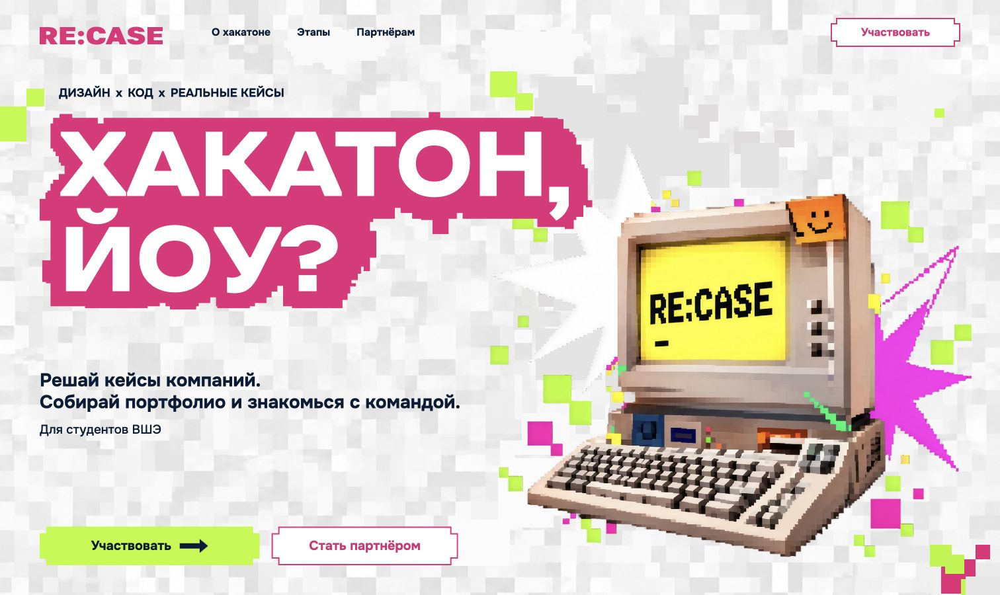

# RE:CASE — Batch 3: Interactive Pixel Particles

Исторический отчёт. Механика частиц обновлена в [Particles & Pixel Morph Refinement](./RECASE_Particles_PixelMorph_Refinement.md); исходная Hero-графика сохранена.

Реализован M03 из Balanced Motion Plan. Движение — ответ на курсор; без постоянной анимации и новых runtime-зависимостей.

## Графика

Оба Hero SVG-фона перенесены в inline SVG внутри прежних декоративных контейнеров. Семь существующих прямоугольников отделены в группы `g[data-hero-particle]`. Остальные контуры статичны. Цвета, координаты, viewBox и порядок рисования сохранены. Исходные SVG остались справочными ассетами и больше не подключаются как Hero-фоны: статической копии частиц на странице нет. PNG не менялся.

Координаты и размеры в исходном viewBox `1512 × 909`:

| Источник | x, y | Размер | Цвет |
|---|---|---|---|
| hero-decoration.svg | 1171, 197 | 30 × 26 | rgb(223,221,221) |
| hero-decoration.svg | 1110, 199 | 39 × 34 | rgb(223,221,221) |
| hero-decoration.svg | 1413, 164 | 15 × 14 | rgb(186,251,43) |
| hero-foreground.svg | 1475, 824 | 22 × 22 | rgb(232,34,121) |
| hero-foreground.svg | 40, 134 | 27 × 27 | rgb(186,251,43) |
| hero-foreground.svg | 789, 433 | 21 × 30 | rgb(231,231,230) |
| hero-foreground.svg | 776, 465 | 39 × 34 | rgb(231,231,230) |

## Движение и жизненный цикл

`src/motion/particles.js`: Vanilla JS, rAF, `translate3d`. Радиус 110 CSS px; целевое смещение до 18 CSS px. Сила зависит от расстояния через smoothstep. Направление считается от неподвижного центра частицы, чтобы перемещение самой частицы не вызывало колебаний силы.

Пружина: mass 1, stiffness 320, damping 30. Сохраняется скорость при смене цели. Время шага ограничено 1/30 s, интеграция разбивается на шаги не длиннее 1/120 s. Отображаемое смещение округляется до целого CSS px до пересчёта в координаты SVG. Scale, rotation, blur отсутствуют.

rAF останавливается при погрешности позиции меньше 0.04 px и скорости меньше 0.2 px/s — в том числе при неподвижном курсоре рядом с частицей. `pointerleave` плавно возвращает частицы; IntersectionObserver вне viewport и скрытая вкладка сбрасывают движение и отменяют цикл. Геометрия двух SVG кэшируется и обновляется только после входа, resize или scroll. Нет DOM-измерений на каждом кадре. Инициализация защищена от повторов; есть cleanup для HMR.

Эффект включён от 1024 px при `hover: hover`, `pointer: fine`, `prefers-reduced-motion: no-preference`. На адаптивах сохраняется прежнее скрытие SVG-декора; компьютер с запечёнными пикселями остаётся статичным. Touchmove-обработчиков нет. Изменение media query отключает слушатели и возвращает исходные позиции.

## QA — Chrome, две целевые итерации

- Desktop 1512 × 900: медленное приближение, быстрый проход через группу, остановка курсора, возврат, выход курсора из частично видимого Hero, прокрутка за Hero и повторный вход. Основной CTA открывает форму; декор не перехватывает события.
- Tablet 744 × 1024 и Mobile 390 × 844: эффект отключён, ноль pointermove-слушателей частиц и ноль кадров их rAF, нет горизонтального переполнения.
- Reduced-motion проверен эмуляцией MediaQueryList на временном стенде: при загрузке и при изменении предпочтения. Частицы в исходных позициях, слушатели отключены, rAF отсутствует. Системная настройка ОС не переключалась.
- Сравнение скриншотов с исходными SVG-фонами и неподвижным inline SVG: ноль отличающихся пикселей вне временных QA-кнопок. Дополнительно проверено точное сохранение всех исходных контуров и их порядка.
- Кадровая запись быстрого прохода и приближения: медианный интервал 16.7 ms, максимальный 17.8 ms внутри непрерывных записей; long tasks и layout shifts при взаимодействии не зафиксированы. Измерений геометрии при быстром проходе — ноль. При затухании pending rAF — ноль.
- Исправление после первой итерации: исключены контуры, закрытые крупными статичными слоями/PNG; добавлены видимые существующие прямоугольники переднего SVG. Новых пикселей нет. Швы, дублирование, перекрытие текста и конфликты transform не обнаружены.

Временный QA-стенд удалён. Batch 1, Scroll Reveals, typography, CTA и viewport-adaptive layout не изменены.

`npm run build` — успешно, 25 модулей, 607 ms. `node --check` и `git diff --check` — успешно. Git push не выполнялся.

