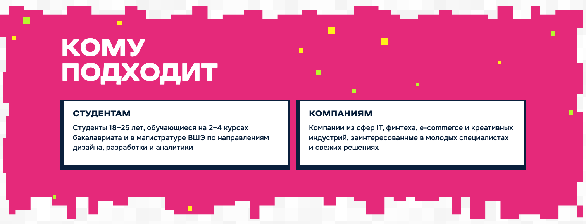
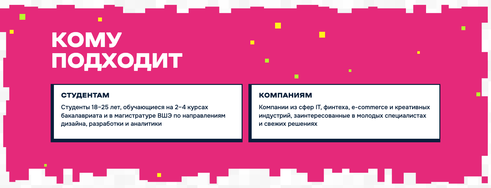

# RE — Particles & Full-Perimeter Pixel Morph

Refinement от 2026-10-09 по видео-референсу. Заменяет временный cursor trail и локальную pixel wave из предыдущей реализации. Уточнение задачи разрешает morph контуров, которые в исходном Balanced Plan оставались статичными.

## Particles

`src/motion/particles.js`: единая система притяжения существующих и новых отдельных пикселей. Отталкивание Hero и временный cursor-follow удалены; конфликтующих обработчиков нет.

| Секция | Новых на Desktop | Существующих отдельных элементов |
|---|---:|---:|
| Hero | 28 | 7 SVG-групп |
| Кому подходит | 12 | 14 DOM-пикселей |
| Формат | 12 | 14 DOM-пикселей |
| Готовы попробовать? | 12 | 10 DOM-пикселей |
| Заинтересовало? | 12 | 10 DOM-пикселей |
| Итого | **76** | **55** |

Размеры новых квадратов — 6/8/10/12 CSS px. Цвета соответствуют палитре каждой секции. Все исходные графические элементы сохраняются на прежних местах; новые размещаются детерминированно в свободных областях с защитой текста, CTA, карточек, компьютеров и существующего цветного SVG-декора. PNG и исходные SVG-файлы не изменены и не дублируются новыми частицами.

Радиус — 140 px. Взаимодействуют максимум восемь ближайших элементов. Ограничение смещения — 20 px, с дополнительным ограничением 35% расстояния до курсора, чтобы частица не перескакивала через его центр. Пружина: mass 1, stiffness 320, damping 30. Медленное приближение в QA дало плавное смещение до 15 px; удаление курсора возвращает элементы на исходные позиции.

Координаты translate3d округляются в CSS px; для SVG затем пересчитываются в artwork units. Нет scale, rotation, blur. Геометрия кэшируется; в tick DOM-измерений нет. Один rAF системы работает только до установления равновесия, включая неподвижный курсор рядом с частицей. Pointerleave плавно возвращает частицы; scroll, уход из viewport, blur, скрытие вкладки и cleanup отменяют цикл.

На touch сохраняется статичный декор меньшей плотности. Проверенные новые элементы: Tablet 744 — 11/6/6/6/6 по секциям; Mobile 390 — 8/4/4/0/3. Размещение ограничивается свободным пространством, поэтому Mobile CTA не получает новых пикселей поверх контента.

## Full-Perimeter Pixel Morph

`src/motion/pixel-morph.js`: два состояния геометрии default/hover. Сначала реализован и проверен эталон `.audience`: изменения присутствуют на верхнем, нижнем и обоих боковых краях; область контента не отличается; после mouseleave скриншот совпадает с исходным. После этого решение распространено на остальные поверхности.

Аудит обнаружил SVG masks, SVG-фоны, отдельные SVG img, clip-path кнопок и рамок, а также адаптивные border-image. На Desktop динамический SVG-слой использует контуры существующего ассета. Только исходный декоративный слой скрывается на время morph; текст и layout остаются независимыми. На возврате восстанавливается исходная графика и исходный path. Размеры контейнеров и viewBox-композиция сохраняются.

Монотонное перемещение линий сетки перестраивает существующие ступени по всему периметру, сохраняя прямые углы и порядок вершин. В рамках меняются оба контура вместе с сохранением прозрачного центра. Целочисленное округление учитывает порядок близких линий, предотвращая пересечения на промежуточных кадрах. Длительность in/out — 280 ms, существующий UI easing cubic-bezier(.2,.7,.2,1). Максимальный сдвиг линий: 12 px на больших секциях, 8 px на малых формах, с ограничением по размеру графики. Быстрый hover-out начинает возврат из текущего состояния.

Эффект получили **18 декоративных поверхностей**:

- Розовые `.audience`, `.format`; салатовые `.participate`, `.contacts`.
- Hero title shape.
- Обе статистические плашки: «19 резюме» и «+30%».
- Три карточки Roadmap: registration, championship, defence.
- Три рамки «Эффекты»: teams, solutions, weeks.
- Плашка «Цель на первый сезон».
- Оба стикера: idea/team. Меняется маска, внутренние иконки и надписи сохраняются. Триггер — существующая область соответствующего блока, поскольку декоративные изображения имеют pointer-events:none.
- Hero process strip и CTA «Станьте частью RE:CASE». Default сохраняет исходную заливку и декор; hover добавляет небольшие вырезы 6 px по всем четырём сторонам. Существующий декор рисуется один раз; слой ограничен исходным box.

Дополнительно CSS clip-path morph применяется к пиксельным кнопкам, навигационным рамкам и оболочке модали. Все четыре ступенчатых угла меняются совместно на 4 px за 240 ms, steps(4,end); контур feedback/outline синхронизирован, толщина рамки сохранена. На hover вырез уменьшается: область попадания расширяется, поэтому изменение края не сбрасывает hover под неподвижным курсором. Прежние цвета, hover/active/focus и их timings сохранены.

Фотографии, запечённые части PNG, логотипы, буквы, номера и внутренние иконки не деформируются. Информационные блоки не получают cursor:pointer, tabindex или click-handler.

## Card hover

Четыре `.benefit-card`: подъём −3 px, border-color → насыщенно-розовый; 160 ms и существующий UI easing. Individual translate компонуется с reveal-transform, не меняя размеры, рамку, текст или сетку. На touch отсутствует hover, при reduced-motion пространственное смещение отключено.

## QA и исправления

Chromium / Playwright: **1512 × 900, 1280 × 800, 744 × 1024, 390 × 844**. Touch и reduced-motion проверены браузерной эмуляцией, включая загрузку и динамическую смену предпочтения.

- Проверены медленное приближение, быстрые движения, установление равновесия при неподвижном курсоре, возврат, уход из секций, быстрый scroll и повторный вход. После завершения pending rAF — ноль. На touch/reduced — ноль кадров новых JS-эффектов. Измерений DOM из tick — ноль.
- Все SVG-поверхности проверены на hover/return и неподвижность текстовых блоков; оценены реальные браузерные кадры. Для Hero и тонких рамок дополнительно проверены последовательности промежуточных кадров in/out, по 55–56 кадров: после исправления пересечений сетки — ноль.
- Все четыре benefit-card проверены на обеих Desktop-ширинах и статичных адаптивах. Размеры, border-width, отступы и типографика совпали с исходными; горизонтальный overflow отсутствует.
- В статичном Hero области заголовка, компьютера, CTA и шапки совпали с исходным скриншотом. Hero Boot Sequence, Roadmap reveal, Scroll Reveals и их durations/easing не редактировались.
- Для эталонной секции и обеих полос возврат к исходной форме подтверждён сравнением скриншотов. Белых швов и разрывов контура в проверенных кадрах не выявлено.
- Проверены стабильный hover у угла CTA, opening/closing модали через CTA/Escape/close, touch-меню и cleanup модулей. Заявки не отправлялись.
- Исправлены недостаточная плотность и отсутствие заметных Hero-частиц, локальная волна вместо полного morph, потеря точности размера SVG-слоя при переносе CSS-значений и пересечения близких линий при независимом округлении. Последние исправления проверены целевыми повторными проверками.

При reduced-motion и на touch динамические SVG-слои не создаются. Исходные адаптивные masks, border-image и clip-path сохраняются. На Desktop после окончания переходов и при скрытии вкладки постоянной анимации нет; наблюдаемой длительной нагрузки во время локального QA не обнаружено.

`npm run build`, `node --check`, `git diff --check` — успешно. Новых runtime-зависимостей нет. Git push не выполнялся.

Эталон перед morph:

Эталон при hover:

